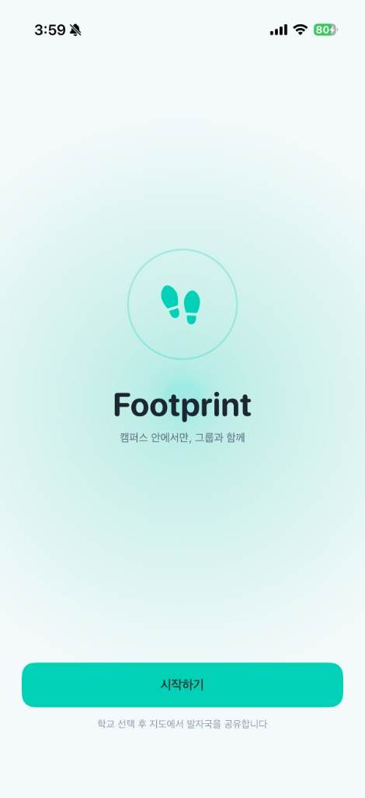
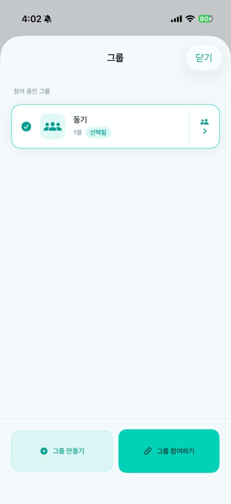
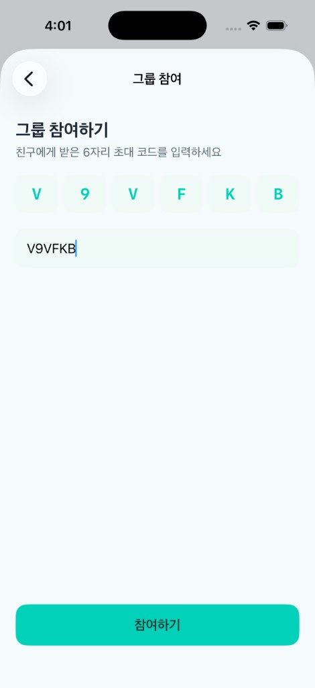
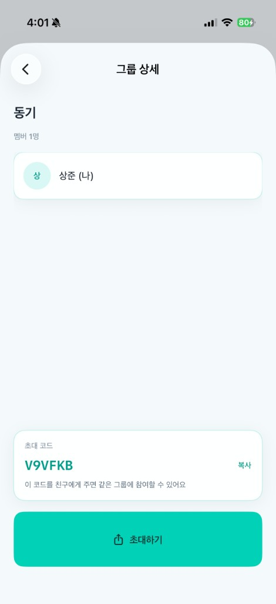
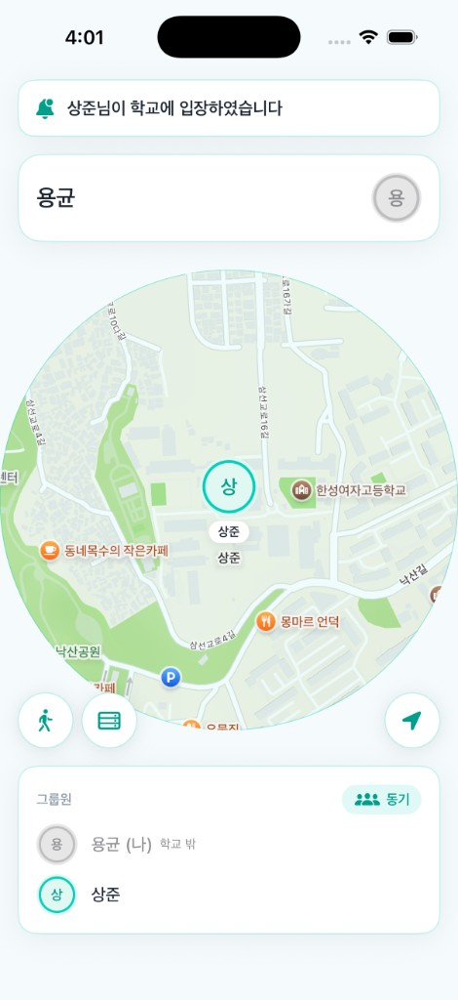

# Footprint

**캠퍼스 그룹 위치 공유 어플리케이션**

**2271525 백상준**

---

## 1. 프로젝트 수행 목적

### 1.1 프로젝트 정의

대학 캠퍼스 안에서 **그룹 단위로 실시간 위치를 공유**하고, **발자국(이동 흔적)** 과 **1:1 채팅**으로 친구와 연결하는 iOS 모바일 애플리케이션

### 1.2 프로젝트 배경

대학생들은 동아리, 동기, 수업 팀 등 **소규모 그룹** 안에서 "지금 어디 있지?"를 자주 묻는다. 기존 위치 공유 앱은 범위가 넓고, 캠퍼스 밖까지 계속 공유되는 경우가 많아 부담스럽다.

또한 단순히 좌표만 보여 주는 것보다, **캠퍼스 안에서만** 위치가 공유되고 **같이 걸어 온 흔적**을 지도 위에 남기면 친구와의 만남이 더 자연스럽다. 그룹원에게 **빠르게 메시지를 보낼 수 있는 채널**도 함께 필요하다.

### 1.3 프로젝트 목표

| 목표 | 설명 |
|------|------|
| **캠퍼스 지오펜싱** | 캠퍼스 원형 경계 안에 들어왔을 때만 위치 공유 |
| **그룹 기반 위치 공유** | 초대 코드 그룹, 멤버에게만 위치·발자국 표시 |
| **실시간 지도 동기화** | 서버와 주기적 동기화로 그룹원 위치 반영 |
| **발자국 표시** | 캠퍼스 안 이동 경로를 지도 위 아이콘으로 시각화 |
| **1:1 채팅** | 그룹원·지도 마커에서 채팅, 새 메시지 상단 알림 |
| **온보딩 UX** | 학교 검색 → 이름 설정 → 지도 (그룹은 지도에서 관리) |

---

## 2. 프로젝트 개요

### 2.1 프로젝트 설명

- **온보딩:** 스플래시 → **학교 검색** → 이름 설정 → 지도
- **지도:** 캠퍼스 원형 영역, 발자국, 그룹원 마커
- **그룹:** 만들기/참여, 멤버 목록, 초대 코드
- **채팅:** 1:1 메시지, 원터치 텔레파시, 상단 알림 배너
- **서버:** FastAPI, 3초 간격 위치·채팅 동기화

### 2.2 프로젝트 구조

```
Footprint/
├── backend/          # FastAPI 서버
├── miniproject/      # iOS 앱 (SwiftUI)
└── docs/             # 사용자 흐름 문서
```

### 2.3 결과물

#### 시작 화면

<p align="center">
  
  
</p>

#### 그룹 생성 화면

<p align="center">
  
  
  
  
</p>

#### 지도 메인 화면

<p align="center">
  
</p>

#### 채팅 화면

<p align="center">
  
</p>

### 2.4 기대효과

- **캠퍼스 안에서만 공유** → 프라이버시 부담 감소
- **그룹 단위 공유** → 친한 사람들끼리만 확인
- **발자국·채팅** → 만남 조율 용이

### 2.5 관련 기술

| 구분 | 설명 |
|------|------|
| **지오펜싱** | GPS 좌표가 캠퍼스 원 안에 있는지 판별 |
| **MapKit** | 지도 표시, 마커·오버레이, 카메라 제어 |
| **CoreLocation** | 기기 GPS·나침반 정보 수신 |
| **REST API** | HTTP 기반 클라이언트-서버 통신 |
| **SwiftUI** | 선언형 UI 프레임워크 |
| **FastAPI** | Python 기반 REST API 서버 |
| **Polling** | 3초 주기 서버 동기화 |

### 2.6 개발 도구

| 구분 | 설명 |
|------|------|
| **Xcode** | iOS 앱 빌드·배포 IDE |
| **Swift** | iOS 클라이언트 개발 언어 |
| **Python** | 백엔드 서버 개발 언어 |
| **FastAPI** | REST API 프레임워크 |
| **Git / GitHub** | 버전 관리 및 소스 공유 |

### 2.7 발표 영상


https://youtu.be/yjYrc5LWyoM

---

**GitHub:** https://github.com/Baeksnagjun/Footprint
