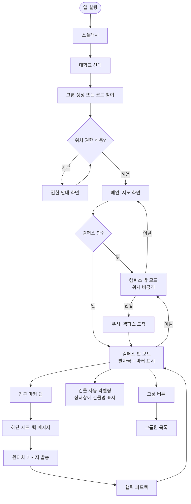
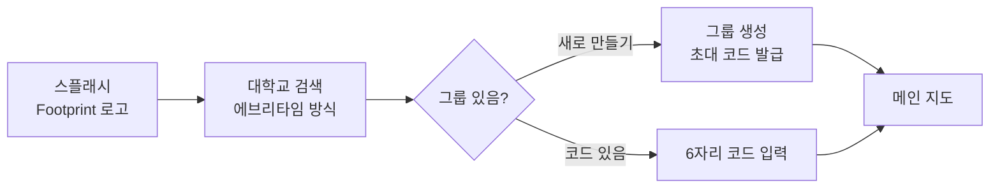
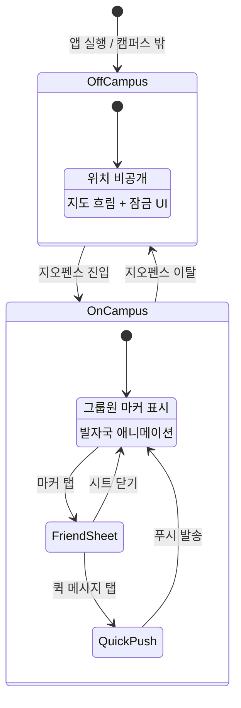
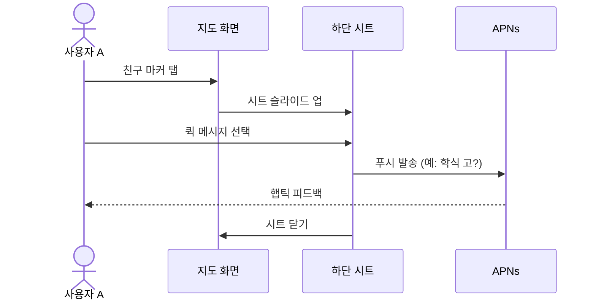

# Footprint 사용자 흐름 (User Flow)

> 캠퍼스 지오펜싱 기반 위치·발자국 공유 앱  
> 저장: 이 파일을 그대로 복사하거나, 아래 Mermaid를 [mermaid.live](https://mermaid.live)에 붙여 PNG/SVG로보낼 수 있습니다.

---

## 1. 전체 흐름 (한눈에)

---

## 2. 온보딩 흐름 (최초 1회)

| 단계 | 화면 | 사용자 행동 | 시스템 반응 (목표) |
|------|------|-------------|-------------------|
| 1 | 스플래시 | 「시작하기」 탭 | 온보딩 시작 |
| 2 | 대학교 선택 | 학교 검색·선택 | 캠퍼스 바운더리 등록 (한성대 등) |
| 3 | 그룹 설정 | 생성 또는 코드 입력 | 그룹 ID·멤버 연결 |
| 4 | 권한 (미구현) | 위치·알림 허용 | CoreLocation / APNs 준비 |

---

## 3. 메인 지도 흐름 (반복 사용)

| 상태 | UI | 공유 여부 |
|------|-----|----------|
| 캠퍼스 밖 | 「사생활 보호 모드」, 지도 비활성 | 그룹에 위치 미전송 |
| 캠퍼스 안 | 네온 마커·발자국, 「상상관」 등 건물명 | 동일 그룹만 실시간 공유 |
| 친구 탭 | 하단 시트 + 퀵 메시지 4종 | APNs 푸시 (구현 예정) |

---

## 4. 화면 목록 ↔ UI 시안 매핑

| # | 화면명 | Xcode 시안 메뉴 | 문서 시나리오 |
|---|--------|-----------------|---------------|
| 1 | 스플래시 | 스플래시 | 2.2 가. 최초 실행 |
| 2 | 대학교 선택 | 대학교 선택 | 2.2 가. 학교 선택 |
| 3 | 그룹 설정 | 그룹 설정 | 2.2 가. 그룹 생성/참여 |
| 4 | 캠퍼스 지도 | 캠퍼스 지도 (메인) | 2.2 나. 지오펜싱 공유 |
| 5 | 캠퍼스 밖 | 캠퍼스 밖 | 2.2 나. (밖일 때) |
| 6 | 퀵 메시지 시트 | 퀵 메시지 시트 | 2.2 라. 원터치 텔레파시 |

---

## 5. 시퀀스 (친구에게 메시지 보내기)

---

## 6. PNG/SVG로 저장하는 방법

1. [https://mermaid.live](https://mermaid.live) 접속  
2. 위 **「1. 전체 흐름」** 코드 블록 내용만 복사해 붙여넣기  
3. 우측 상단 **Export** → PNG 또는 SVG 저장  
4. 과제/발표 자료에 삽입

---

*Footprint · iOS 프로그래밍 미니프로젝트 · UI/UX 흐름도 v1*
